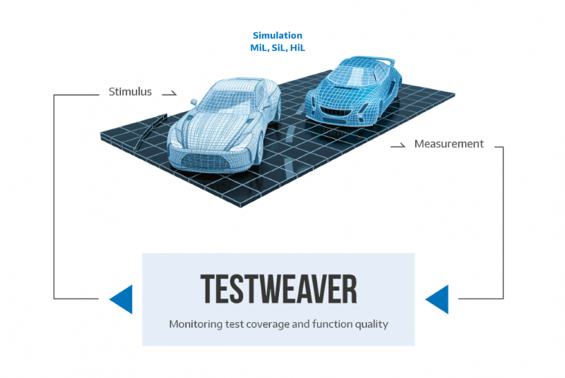

[.conf-macro .output-inline]#This plugin integrates Jenkins with the
https://qtronic.de/en/weaver.html[TestWeaver] tool suite provided by
http://www.qtronic.de/[QTronic GmbH]. The tool generates JUnit XML and
HTML reports files.#

[[TestWeaverPlugin-TestWeavertool]]
== TestWeaver tool

[[TestWeaverPlugin-Largecoveragetestingofcontrolfunctions]]
=== Large coverage testing of control functions

TestWeaver is a tool for automated test and validation of control
functions. TestWeaver generates, runs and evaluates thousands of test
scenarios automatically. Each test scenario is a sequence of inputs over
time, automatically performed during simulations. TestWeaver generates
the tests in a reactive, informed way, trying to learn the system
behavior from the results of the previous simulations, in order to
increase state coverage and to actively worsen sub-optimal scenarios
until the system behavior is really bad, i.e. a bug or a design flaw has
been found. TestWeaver also supports classical test automation methods,
based on:

* interactive recording and replay of scenarios
* user-defined test scripts, for instance with Python.

Supported development and simulation environments include:
https://qtronic.de/en/silver.html[Silver], MATLAB/Simulink, Dymola,
SimulationX, CarMaker, VTD and PreScan, as well as hardware-in-the-loop
simulation platforms.

[[TestWeaverPlugin-Benefits]]
=== Benefits

[.confluence-embedded-file-wrapper .confluence-embedded-manual-size]##

 +

 +

* Fast development: early problem detection
* High test coverage: thousands of high-quality tests
* Low work load: more automation, less scripting

TestWeaver is in use for automated test and validation of complex
systems at AMG, Bosch, Mercedes-Benz, Porsche, Volvo Car Corporation,
IAV, SAIC, TREMEC, ZF and others.

[[TestWeaverPlugin-Configuration]]
== Configuration

[[TestWeaverPlugin-RunandexportexperimentsasJUnitXML]]
=== Run and export experiments as JUnit XML

TestWeaver can export the experiment results as reports in the JUnit XML
format. This format is easy to integrate in Jenkins. TestWeaver will run
in an automation mode that does not require any user interaction. After
the export is finished TestWeaver closes automatically.

* To start TestWeaver you are required to set the path to the TestWeaver
project, the experiment names to be run and the path to the location
where to export the JUnit XML result file. The experiment names can be
specified using the wildcard syntax.
* This starts one or more experiments automatically from the named
project one after the other. Before being started, any existing
scenarios of the selected experiments are deleted, so that the test
results will be computed from scratch and are therefore up-to date.
* Optionally, you can activate the generation of HTML reports of the
executed experiments by setting the path to the directory where to store
the HTML reports.
* Optionally, you can specify a file with configuration parameters that
have to be used for the current test and a file with silver parameters.
* After the experiments are finished their results are exported in the
JUnit XML format in a file called `+unit-test.xml+` in the named
`+export_dir+`.

[.confluence-embedded-file-wrapper]#image:docs/images/basic0.PNG[Basic
Configuration,title="Basic Configuration"]#

[[TestWeaverPlugin-Advancedoptions]]
=== Advanced options

The Advanced button opens extra options for TestWeaver configuration.

* In case you are using TestWeaver LIGHT the automatic scenario
generation that can be performed by TestWeaver is disabled. In this case
the experiments run user defined scripts and test databases, only.
Additionally to the exported test cases for the user defined scripts and
test databases, an additional test case will be reported for the
consistency of the used SUT Configuration Parameters.

* On the other side, in case you are using TestWeaver with the automatic
scenario generation you must specify the options that control the
termination of the automatic generation using at least one of the
options:
** `+Run scenario limit: NUMBER+` to limit the maximum number of
automatically generated scenarios per experiment, and/ or
** `+Run time limit: MINUTES+` to limit the maximum amount of time
allowed for the execution of an experiment.
* `+Namespace pattern: PATTERN+` option allows you to customize the
aggregation of the test suites for software components. Jenkins / JUnit
XML is able to display by default only three levels of aggregation. You
might have more levels in your project. The `+PATTERN+` argument allows
you to specify a mapping, for instance: `+myDomain.{P}/{E}.{T}+`, will
merge the project and the experiment name in the second level for the
export - where `+P+`, `+E+`, `+T+` stand for project, experiment, test
case. The default mapping (when you do not supply a specific namespace)
is: `+{P}.{E}.{T}+`.

[.confluence-embedded-file-wrapper]#image:docs/images/allOptions1.PNG[All
Configurations,title="All Configurations"]#

[[TestWeaverPlugin-Exportingview]]
=== Exporting view

For exporting the experiment results you can choose between the:

* default export view: this exports the user defined scripts and
scenarios from the test databases individually as test cases. In
addition, the following properties are mapped to test cases as well:
** completeness of tested requirement watchers, thus checking the
coverage of the requirements monitored by watcher instruments.
** in case automatic generation is enabled in the experiment
specification, then one more test case will be exported, namely one that
merges the pass/fail results of all automatically generated scenarios.
For instance, if at least one automatically generated scenario detected
a failure then the merged test case is marked as failed.
* export with instruments view by checking `+Instrument view+` checkbox:
this gives more details than the default view, namely this exports every
reporter and watcher instrument, as well as the termination monitor as a
test case in the exported test suite.
** This view is recommended for the export of experiments that use the
automatic scenario generation.

[[TestWeaverPlugin-Compatibility]]
== Compatibility

* Jenkins 2.7.3 or higher
* https://qtronic.de/en/weaver.html[TestWeaver] 3.4 or higher

[[TestWeaverPlugin-License]]
== License

This plugin is licensed under 3-clause MIT license. +
More information can be found inside the
https://github.com/jenkinsci/testweaver-plugin/blob/master/LICENSE[LICENSE]
file.

[[TestWeaverPlugin-Release1.0.3(Aug19,2019)]]
=== Release 1.0.3 (Aug 19, 2019)

* new option: [.blob-code-inner .blob-code-marker]#[.pl-s]#Accept
inconclusive watchers##.
[.blob-code-inner .blob-code-marker]#[.pl-s]#[.x .x-first .x-last]##Inconclusive
##watchers [.x .x-first .x-last]##(incomplete
##test[.x .x-first .x-last]#) should not lead to a failed test.
Available starting with TestWeaver 4.1. +
###

[[TestWeaverPlugin-Release1.0(Jul20,2018)]]
=== Release 1.0 (Jul 20, 2018)

image:docs/images/information.svg[(info)]
Initial release

 +

 +
